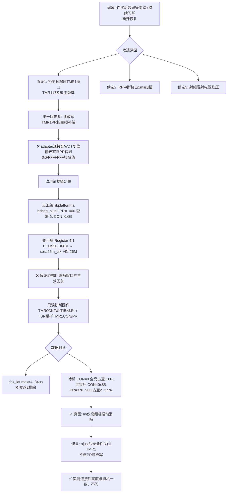
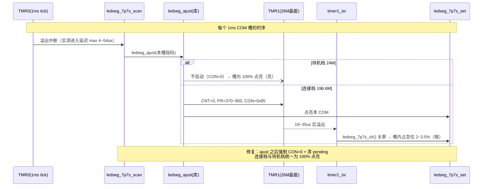

# 排错记录：无线连接建立后数码管变暗且持续闪烁

| 项目 | 内容 |
| --- | --- |
| 硬件 | AB5712F（K16B 板），发送端 emit（wireless_mic_emit）+ 接收端 adapter（wireless_adapter） |
| SDK | 中科蓝讯 bt8930 硅族 SDK，`app/projects/microphone`（CONFIG_WIRELESS_LE_MIC 方案） |
| 现象 | 发送端开机数码管亮度正常；与接收端建立无线连接后明显变暗，并持续闪烁；断开连接后恢复 |
| 分支 | `branch_01` |
| 结论 | 闭源库 `ledseg_ajust()` 仅在高频档（连接后）启动 TMR1 消隐，把数码管占空压到约 2~3.5%；修复为在每次扫描后强制关闭消隐，统一为待机态的全亮占空 |

---

## 1. 问题现象

发送端串口日志（连接成功前后）：

```text
gui_box_flicker_set 
addr: d7 9a ef e0 42 41 
WIRELESS_CONNECTED,0 1
WIRELESS_CON_ROLE, 0
TX: pdu=(150B, 742), intv=(15000, 817), retry=(3, 8)
LED_USER_CONN
```

- 连接建立（`WIRELESS_CONNECTED`）后数码管立刻变暗，并持续闪烁；
- 断开连接后数码管恢复初始亮度；
- 接收端（adapter）同样存在该问题（修复位于两端共用的扫描代码中）。

初步怀疑方向（用户第一直觉）："连接后抬主频推屏幕会变暗"。

---

## 2. 显示驱动背景（排查前需要了解的机制）

数码管为 7COM×7SEG（7P7S）动态扫描，驱动链路：

| 环节 | 代码位置 | 说明 |
| --- | --- | --- |
| 1ms tick 中断 | `app/system/system.c` `usr_tmr1ms_isr()` | TMR0 跑固定 1MHz（PCLKSEL=110），每 1ms 调 `gui_scan()` |
| COM 扫描 | `app/modules/gui/ledseg/ledseg_7p7s.c` `ledseg_7p7s_scan()` | 7 个 COM 轮流点亮，帧率 ≈ 1000/7 ≈ 143Hz |
| 占空/消隐 | 闭源库 `ledseg_ajust()`（libplatform.a） | 配置 TMR1；`timer1_isr()`（`app/system/interrupt.c`）在 TMR1 溢出时调 `ledseg_7p7s_clr()` 关屏 |
| 点亮 COM | `app/projects/microphone/port/port_ledseg.c` `ledseg_7p7s_set()` | GPIO 高驱动，先全关再点亮 |

系统主频：开机基础主频 `SYS_CLK_SEL = SYS_24M`（`config_wireless_mic.h:24`）；无线连接成功回调里抬高（`app/modules/wireless/wireless_proc.c`，`sys_clk_req(INDEX_KARAOK, SYS_120M)` → `SYS_160M`，**实测 `SYS_160M` 档实际频率为 196.608MHz**）；断开后 `sys_clk_free(INDEX_KARAOK)` 回到 24M。

---

## 3. 排查过程（三轮，含错误路线）

### 3.1 第一轮：TMR1 跑主频域的假设（错误）→ 导致 adapter 连接复位

**假设**：亮度占空由 TMR1 消隐窗口决定，点亮时长 = TMR1PR ÷ 主频；TMR1 默认跑系统主频（手册复位默认 PCLKSEL=000），lib 按开机 24M 写死 PR，连接后主频抬到 196.6M → 点亮窗口缩为 24/196.6 ≈ 12% → 变暗。

**第一版修复**（已被否定回滚）：在 `ledseg_7p7s_scan()` 的 `ledseg_ajust()` 之后，停表 → `TMR1PR = TMR1PR × 当前主频 / 24M` → 恢复 CON。

**实测结果——修复引入了更严重的问题**：

```text
adapter 端：WIRELESS_CONNECTED,0 0 之后立刻复位重启
Hello BT893X: 88010039
SDK : v0150, LIBS: v0150
WDT reset                      ← 看门狗复位，说明刚才是被拖死的
...
emit 端：WIRELESS_CONNECT_FAIL, 0 反复出现   ← adapter 在反复重启，自然连不上
```

**当时的诊断打印还暴露了关键疑点**：

```text
LEDSEG CLK: 24000000 Hz, TMR1CON=0, TMR1PR=-1
```

`TMR1PR` 读出来是 `0xFFFFFFFF`：若 lib 真把 PR 写成 -1，数码管将永远不消隐（全亮），与"待机亮度正常但也不是刺眼的全亮"矛盾——**说明停表状态下读 TMR1PR 返回的是无效值**。第一版修复"读-改-写 PR"拿到垃圾值回写，TMR1 行为异常引发中断风暴，系统被拖死进 WDT 复位循环。

> 教训 1：不要对语义未确认的寄存器做"读-改-写"。
> 教训 2：诊断打印本身就是试金石——读值明显违背硬件常识时，先怀疑读值路径，再怀疑理论。

### 3.2 第二轮：反汇编闭源库 + 查原厂手册（定性）

不猜寄存器，两条证据链：

**证据 A：反汇编 libplatform.a 的 `ledseg_ajust`**（工具链 `riscv32-elf-nm` 定位符号 + capstone 解码，重定位项还原真实地址）：

```text
ledseg_ajust():
  *(0x118) = 0          // TMR1CNT = 0（sfr.h:48，清计数）
  TMR1PR = 1000 - 占空比查表值   // *(0x11C)，查表按当前 COM 槽点亮段数
  TMR1CON = 0x85        // *(0x110)：TMREN=1, PCLKSEL=010, IRQ_EN=1
```

> 该结论与原厂其他芯片 SDK 公开的 `ledseg_ajust` 源码逐条同构（`seg_num = s_bcnt(disp_seg)` → 查表 → `TMRxPR = 1000 - ledseg_tbl[seg_num-1]` → `TMRxCON = BIT(7)|BIT(2)|BIT(0)`，仅定时器实例为 TMR4），可交叉印证，见 `docs/peripheral/ledseg-7p7s-display.md`。

**证据 B：原厂手册《ab571x_usermanual.pdf》Register 4-1（第 37 页）**：

```text
TMRxCON bits[3:1] PCLKSEL（Pre-divider clock source selection）：
  000: system clock        100: rc2m
  001: sys_clkppp          101: rtc_rc2m
  010: xosc26m_clk         110: tmr_inc_cr
  011: tmr_inc_pin         111: clkout_pinp
```

`0x85` 的 PCLKSEL=010 → **TMR1 跑 26M 晶振（固定频率），与系统主频无关**。
第一轮的"抬主频缩短消隐窗口"理论被彻底推翻。

### 3.3 第三轮：只读诊断固件（定位真因）

在全只读、不写任何定时器寄存器的前提下加三处诊断：

1. `usr_tmr1ms_isr()` 入口读 `TMR0CNT`：TMR0 溢出后从 0 重数（固定 1MHz，1 count = 1µs），**该读值 = "溢出 → ISR 实际执行"经过的微秒数**，直接量化 RF 对扫描中断的挤占程度；维护 max/avg，每 5 秒由主循环打印；
2. `ledseg_7p7s_scan()` 内 `ledseg_ajust()` 之后采样 `TMR1CON/TMR1PR`（运行态读值）；
3. `ledseg_display()` 里主频变化或每 5 秒打印一行汇总。

诊断代码原文（临时代码，验证后已删除）：

```c
// system.c
volatile u32 dbg_tmr0_lat_max;      //1ms tick 中断进入延迟(µs)——统计窗口内最大值
volatile u32 dbg_tmr0_lat_sum;      //延迟累加(µs)
volatile u16 dbg_tmr0_lat_cnt;      //采样次数

void usr_tmr1ms_isr(void)
{
    //TMR0 跑固定 1MHz(sel=6)，溢出后从 0 重新计数；ISR 进来时读 CNT
    //即"溢出→ISR 实际执行"经过的 µs，用于量化 RF 对扫描中断的挤占
    u32 dbg_lat = TMR0CNT;
    dbg_tmr0_lat_sum += dbg_lat;
    dbg_tmr0_lat_cnt++;
    if (dbg_lat > dbg_tmr0_lat_max) {
        dbg_tmr0_lat_max = dbg_lat;
    }
    ...
}

// ledseg_7p7s.c
volatile u32 dbg_tmr1con;           //ajust 后 TMR1CON/TMR1PR 采样
volatile u32 dbg_tmr1pr;
...
ledseg_ajust(disp_seg);
dbg_tmr1con = TMR1CON;
dbg_tmr1pr = TMR1PR;
ledseg_7p7s_set(disp_seg, com_cnt);

// ledseg_common.c  ledseg_display() 内
static u32 last_nhz;
static u16 rep_cnt;
u32 nhz = get_sysclk_nhz();
if (nhz != last_nhz || ++rep_cnt >= 5000) {     //主频变化或每5秒报告一次
    printf("LEDSEG DBG: clk=%d, TMR1CON=%x TMR1PR=%x, tick_lat max=%d avg=%d us\n", ...);
}
```

**实测数据（发送端，关键节选）**：

```text
────── 待机（未连接，亮度正常）──────
LEDSEG DBG: clk=24000000, TMR1CON=0 TMR1PR=ffffffff, tick_lat max=34 avg=10 us
LEDSEG DBG: clk=24000000, TMR1CON=0 TMR1PR=ffffffff, tick_lat max=34 avg=10 us

────── 连接建立后（变暗+闪烁）──────
WIRELESS_CONNECTED,0 1
LEDSEG DBG: clk=196608000, TMR1CON=85 TMR1PR=320, tick_lat max=34 avg=5 us
LEDSEG DBG: clk=196608000, TMR1CON=85 TMR1PR=1f4, tick_lat max=4 avg=0 us
LEDSEG DBG: clk=196608000, TMR1CON=85 TMR1PR=320, tick_lat max=4 avg=0 us
LEDSEG DBG: clk=196608000, TMR1CON=85 TMR1PR=384, tick_lat max=4 avg=0 us
LEDSEG DBG: clk=196608000, TMR1CON=85 TMR1PR=28a, tick_lat max=4 avg=0 us
```

**数据判读**：

| 状态 | 主频 | TMR1CON | TMR1PR | 点亮占空 | 结论 |
| --- | --- | --- | --- | --- | --- |
| 待机 | 24M | 0（未启动） | ffffffff（复位值） | **100%**（每 COM 槽全程点亮） | lib 不消隐 → 亮 |
| 连接后 | 196.608M | 0x85（消隐开启） | 0x172~0x384（370~900） | 19~35µs / 1000µs ≈ **2~3.5%** | lib 消隐 → 暗 |

- 中断延迟：待机 max=34µs、连接后 max=4µs → **RF 没有挤占扫描中断**，"中断挤占"候选排除；
- 消隐窗口跑 26M 晶振固定时钟 → 与主频无关，"主频推暗"候选排除；
- **真因：lib 的 `ledseg_ajust()` 仅在高频档启动 TMR1 消隐，把占空压到 2~3.5%；且 PR 随显示内容在 370~900 间跳变（约 2.4 倍亮度波动），叠加射频抖动 → 视觉上的"变暗 + 持续闪烁"。**

---

## 4. 根因

`ledseg_ajust()`（闭源库）根据当前系统主频档位选择是否启用 TMR1 消隐：

- 待机档（24M）：不消隐，100% 占空；
- 连接档（196.6M，即 `SYS_160M` 档）：消隐开启，占空 2~3.5%，且占空随每槽点亮段数动态变化。

这是库的内部策略（推测意图为连接工作态降低显示平均电流），并非故障；但视觉上与待机态差异巨大，被用户感知为"连接后变暗、一直闪"。

---

## 5. 修复方案（最终保留的代码）

位置：`app/modules/gui/ledseg/ledseg_7p7s.c`，`ledseg_7p7s_scan()` 内，`ledseg_ajust()` 之后：

```c
ledseg_ajust(disp_seg);
//lib 的 ajust 在高频档(连接后196.6M)会启动 TMR1 消隐(26M晶振源, PR=500~900 →
//占空仅~2-3.5%)，数码管明显变暗且随内容/射频抖动闪烁；待机档(24M)不消隐为全亮。
//这里统一关掉消隐，使连接态亮度与待机一致。
if (TMR1CON != 0) {
    TMR1CON = 0;
    TMR1CPND = BIT(9);              //清溢出 pending，防止残留触发 timer1_isr 关屏
}
ledseg_7p7s_set(disp_seg, com_cnt);
```

要点：

- 只有无条件的寄存器写（CON=0 + 清 pending），**不做任何 PR 读-改-写**（第一版崩溃的根源）；
- 必须放在 `ledseg_ajust()` 之后——lib 每次扫描都会重新配置 TMR1，放在之前会被覆盖；
- 待机态本来就是全额占空长时间运行（设备未连接时一直如此），连接态沿用同样的占空在电气上已被日常使用验证；
- 修复位于 emit/adapter 共用的扫描代码，两端同时生效。

### 曾考虑但放弃的方案

| 方案 | 放弃原因 |
| --- | --- |
| 按主频比例放大 TMR1PR（提高连接态占空） | 需要读-改-写 PR，第一版实测引发中断风暴/WDT 复位 |
| 取消连接后的抬主频 | 196.6M 是无线链路处理（LC3S 编码、算法）所需，动它影响音频 |
| 折中占空（如固定 50%） | 需要写 PR，同样有第一版的风险；如后续想省电流可再评估 |

---

## 6. 验证结果

修复后发送端实测（数码管连接后与待机亮度一致、不闪）：

```text
────── 待机 ──────
LEDSEG DBG: clk=24000000, TMR1CON=0 TMR1PR=ffffffff, tick_lat max=34 avg=10 us
────── 连接后（lib 仍尝试开消隐，被修复代码关闭）──────
WIRELESS_CONNECTED,0 1
LEDSEG DBG: clk=196608000, TMR1CON=85 TMR1PR=320, tick_lat max=34 avg=5 us
LEDSEG DBG: clk=196608000, TMR1CON=85 TMR1PR=1f4, tick_lat max=4 avg=1 us
```

`TMR1CON=85 TMR1PR=320` 是采样点（在关闭动作之前）的值，说明 lib 仍在尝试启动消隐、被本修复关闭——符合预期。

---

## 7. 排查决策过程



## 8. 扫描与消隐时序（修复前后的差异）



---

## 9. 附：可复用的工具与方法

1. **反汇编闭源库**：`riscv32-elf-nm -S libplatform.a` 找符号与尺寸 → 从 .a 中提取对应 ELF 成员 → capstone（`CS_ARCH_RISCV, CS_MODE_RISCV32|CS_MODE_RISCVC`）解码，配合重定位项还原 SFR 真实地址（本芯片 SFR_BASE=0x100，TMR1CON=0x110/TMR1CNT=0x118/TMR1PR=0x11C，与 `include/sfr.h` 一致）；
2. **中断延迟测量**：固定 1MHz 的 tick 定时器溢出后 CNT 从 0 重数，ISR 入口读 CNT 即为"溢出 → ISR 实际执行"的微秒数，无需额外硬件定时器；
3. **手册是最终依据**：`docs/datasheet/ab571x_usermanual.pdf` Register 4-1（TMRxCON）、Register 4-2（TMRxCPND）。
