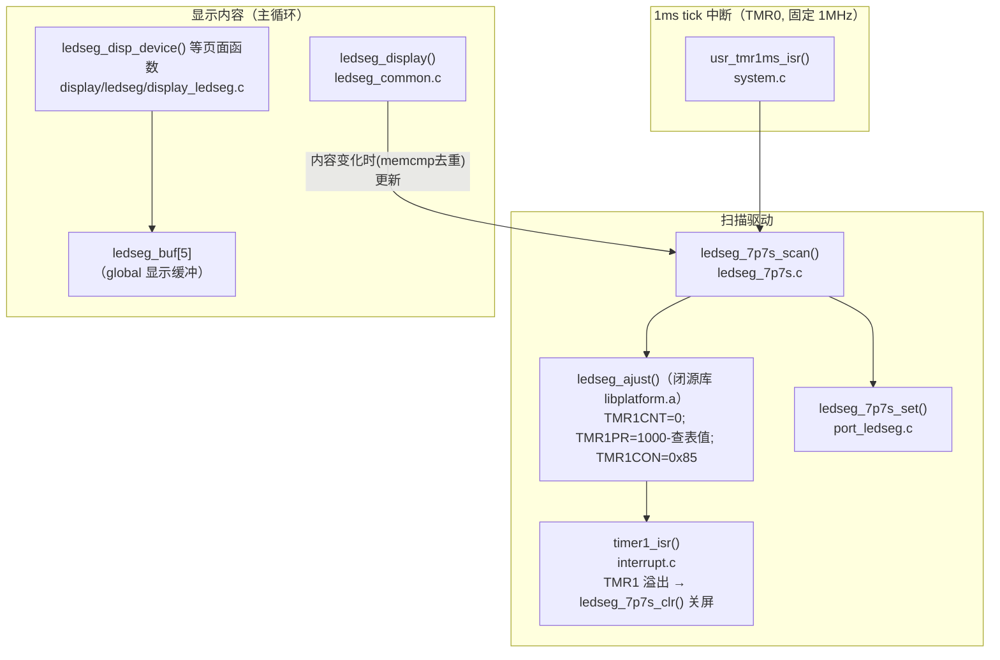

# 数码管（7P7S）基础原理与 SDK 代码实现

适用工程：AB5712F / bt8930 SDK，`app/projects/microphone`（`GUI_SELECT = GUI_LEDSEG_7P7S`，见 `config_wireless_mic.h:29`）。
本文分两部分：先讲数码管显示的通用原理，再对照本 SDK 逐层拆解代码实现。

---

## 1. 数码管基础原理

### 1.1 结构：段（SEG）与公共端（COM）

一个 7 段数码管由 8 个 LED 组成：7 个笔画段 `a b c d e f g` + 1 个小数点 `dp`。所有 LED 的一端并接到公共端（COM，即位选）：

```text
        a
      ┌───┐
    f │   │ b
      ├─g─┤
    e │   │ c
      └───┘ ● dp
        d

共阴接法：COM 接低电平，段脚给高电平点亮
共阳接法：COM 接高电平，段脚给低电平点亮
```

- **段选**（SEG）：决定这一位显示什么字形（数字/字母）；
- **位选**（COM）：决定哪一位数码管被点亮。

### 1.2 动态扫描：为什么不是每位的 COM 常开

多位数码管如果每一位都独立驱动，需要的引脚数 = 位数 × 8，太多。动态扫描利用**视觉暂留**（人眼 > 24Hz 的刷新率看起来就是稳定显示）：

1. 每个周期只点亮**一位**：拉通它的 COM，送上它的段码；
2. 点亮一小段时间（一个"槽"，slot）后熄灭，切到下一位；
3. 轮完一圈为一帧，帧率保持在 ~100Hz 以上人眼就看不到闪烁。

本工程 7 个 COM 槽 × 每槽 1ms = 7ms 一帧，帧率 ≈ **143Hz**。

关键概念：

| 概念 | 含义 | 对显示的影响 |
| --- | --- | --- |
| 槽（slot） | 一位数码管每次点亮的持续时间 | 本工程固定 1ms，由 1ms tick 中断保证 |
| 占空比（duty） | 槽内实际点亮时间的比例 | **直接决定亮度**；也限制 LED 平均电流 |
| 消隐（blanking） | 槽内主动关断显示的窗口 | 用于控制占空（亮度）；切换位选前消隐还能防止"拖影"（上一位的字形残留在下一位上） |

### 1.3 引脚复用矩阵（本工程的实际接法）

本工程没有独立的 COM/SEG 总线，而是 **7 个引脚的复用矩阵**：每个 1ms 槽里，把其中一个引脚拉高作公共端，其余引脚按段码拉低点亮对应 LED（引脚高阻即"熄灭"）。引脚分配见 `app/projects/microphone/port/port_ledseg.c`：

| 槽 | 引脚 |
| --- | --- |
| LEDSEG0~2 | PB0、PB1、PB2 |
| LEDSEG3~5 | PE5、PE6、PE7 |
| LEDSEG6 | PF1 |

全部开启高驱动（`GPIOxDRV`）保证足够的段电流。

### 1.4 亮度控制：TMR1 消隐定时器

点亮 = 槽开始时把 COM 拉高；熄灭 = 定时器到点把全部引脚置回高阻。槽长固定 1ms，**熄灭得越早点亮占空越小、越暗**。这就是亮度控制的机制：

```text
1ms 槽：  ├──────点亮──────┤（占空 100% → 最亮）
1ms 槽：  ├──30µs┤·········（占空 3%   → 很暗）
```

本工程用 TMR1 做这个"到点熄灭"的定时器（消隐定时器）。关键寄存器（`include/sfr.h`，SFR_BASE=0x100）：

| 寄存器 | 地址 | 作用 |
| --- | --- | --- |
| TMR1CON | 0x110 | bit0 TMREN 启动；bits[3:1] PCLKSEL 选时钟源；bit7 中断使能 |
| TMR1CNT | 0x118 | 计数器（写 0 清零） |
| TMR1PR | 0x11C | 周期重载值：点亮窗口 = TMR1PR / TMR1 时钟频率 |
| TMR1CPND | 0x114 | 溢出 pending（写 bit9 清除） |

时钟配置由手册《ab571x_usermanual.pdf》Register 4-1 定义：bits[3:1] **PCLKSEL** 选时钟源（`000=system clock`、`001=sys_clk`、`010=xosc26m_clk`、`011=tmr_inc_pin`、`100=rc2m`、`101=rtc_rc2m`、`110=tmr_inc_cr(24M÷24=1.000M 精确，TMR0 的 1ms 节拍即用此源，见 charge.c)`、`111=clkout`），bits[6:4] **PDIVSEL** 为预分频（`000=÷1 … 110=÷64`）。旧库消隐选 **PCLKSEL=010 = xosc26m_clk、PDIVSEL=÷1**，即 `CON = 0x85`（BIT7 中断使能 | BIT2=PCLKSEL=010 | BIT0 启动）。注意 `xosc26m` 是寄存器源名的**历史命名**：本板实焊 24M 晶振（原理图标注 24M/9pF；原厂时钟图 xosc×2→48M→÷2=bt24m_clk），该源实际 = **24M 晶振直驱**，为射频常开时钟，窗口时长与系统主频档（24M/196.6M）无关。

> **原厂 lib 实现**（原厂提供的本芯片 `ledseg_ajust` 源码，与闭源库反汇编结果逐条吻合）：
>
> ```c
> AT(.com_text.ledseg)
> void ledseg_ajust(uint disp_seg)
> {
>     uint seg_num = s_bcnt(disp_seg);
>     if (seg_num > 0) {
>         //根据需要点亮的SEG数，设定不同的点亮时间。 seg_num越小，点亮时间越短
>         TMR1CNT  = 0;
>         TMR1PR   = 1000 - ledseg_tbl[seg_num-1];
>         TMR1CON  = BIT(7) | BIT(2) | BIT(0);   //timer1 interrupt en, timer1 counter mode
>     }
> }
> ```
>
> 即：段数越少 → 查表值越大 → PR 越小 → 点亮窗口越短，从而按段数均衡亮度。注意 `BIT(2)` 按本芯片手册 Register 4-1 属于 PCLKSEL（bits[3:1]=010=xosc26m_clk），消隐窗口与系统主频无关。

**原厂时钟图/位表要点**：

- 根时钟 = 板载 **24M XOSC**（OSCI/OSCO）：×2 得 XOSC48M（BT 域 bt48m→÷2 bt24m，选择位 `CLKCON0.bt52_sel/bt26_sel`）；SYSPLL 经 DIVCNT 产生系统高档位时钟（393.216M÷2=196.608M），`sys_clk` 经 CKG 门控输出——**待机 24M 档 = xosc 经 sysosc_clk 直供，连接档 = SYSPLL 分频**；
- **tmr_inc_cr（PCLKSEL=110）来自 xosc 分频器 `xosc_divcnt`（clkdivcon1[7:0]）**，÷24 = 1.000MHz 精确——TMR0 的 1ms 节拍与新库 TMR4 消隐都用它；
- 门控位定义（原厂位表）：**CLKGAT0.bit0~5 = tmr0~5_clken**（bit1 即 TMR1 tick 门，`plugin_init()` 补开的 BIT(1) 由此得名）、bit30/31 = tick0/1_clken；**clkgat1.bit1 = xosc_clken**（xosc 到外设路径的门，plugin_init 的 CLKGAT1 写入已含）；clkgat1~3 其余位覆盖 port/ram/rom/dac/anc 等外设；
- 外设寄存器域普遍遵循"先释放 clkgate + soft_rstn 再访问"（手册 15.4）。旧库 TMR1"待机档写不进、连接态阵发失效"的芯片级触发条件，从上述位表仍无法完全解释（门全开时连接态仍阵发失效，v6 实测），最终以原厂 TMR4 迁移为修复依据（排错文档 §5）。

---

## 2. SDK 代码实现

### 2.1 驱动分层总览



### 2.2 数据流：从"要显示什么"到 GPIO


要点：

- **双层缓冲**：应用层写 `ledseg_buf`，扫描层用 `ledseg_cb.buf`；更新时 `disp_en` 先 0 后 1（`ledseg_7p7s_update_dispbuf_do`），避免扫描到半更新的缓冲；
- **去重**：`ledseg_display()` 用 `memcmp` 比较新旧内容，只有变化才走更新路径，但**扫描本身每 1ms 都在跑**（显示是持续刷新的）；
- **字形表**：`ledseg_common.c` 的 `ledseg_num_table[10]`（`T_LEDSEG_0..9` 宏）把数字 0~9 映射成段码位图。

### 2.3 每个 1ms 槽的完整时序


### 2.4 与系统主频的关系（重要）

| 定时器 | 时钟源 | 是否随主频变化 | 用途 |
| --- | --- | --- | --- |
| TMR0 | 固定 1.000MHz（PCLKSEL=110，24M÷24） | 否 | 1ms tick → COM 扫描节拍 |
| TMR1 | 24M 晶振（PCLKSEL=010=xosc26m，历史命名） | 否 | 槽内消隐窗口 → 亮度 |

即**扫描节拍与亮度占空在硬件上都不依赖系统主频**。`ledseg_ajust()` 在点亮段数 >0 时即启动消隐（按段数均衡亮度，与主频无关）。本项目实测发现旧库消隐所用的 TMR1 与待机/无线切频工作状态不兼容（待机档寄存器写入不生效、连接态阵发性失效），表现为"连接后变暗、轻微闪烁"；最终采用原厂新版 `libplatform.a`：库内 `ledseg_ajust()` 的 one-shot 消隐从 TMR1 迁移到 TMR4（PCLKSEL=6，24M÷24=1.000MHz，µs 窗口语义严格成立），应用层仅接入 `timer4_irq_init()` 并新增 `timer4_isr()` 执行关屏。完整过程见
[数码管无线连接后变暗闪烁排错](../client_problem/ledseg-dim-flicker-after-wireless-connect.md)。

### 2.5 显示内容层（应用侧怎么用）

页面函数集中在 `app/projects/microphone/display/ledseg/display_ledseg.c`，通过 `ledseg_disp_pfunc[]` 函数表按页面（DISP_DEVICE 等）分发：

- 数字/频率：`ledseg_disp_number()`（4 位，>9999 截断）；
- 图标：`ledseg_buf[4]` 的位定义（`display_ledseg.h`）：`ICON_BT`、`ICON_WIR_A`、`ICON_WIR_B` 等，例如无线麦页面显示 `24.02`/`24.08`（当前频道 MHz）+ 蓝牙图标，由双击切换（`msg_device.c`）；
- 电池：`disp_bat()` 按电量点亮 1~4 格图标，低电时结合 `gui_box_flicker`（100ms 节拍翻转的消隐标志）实现半格闪烁；
- 整屏闪烁：`gui_box_flicker_set()`（`modules/gui/gui.c`）设置消隐标志，特定页面（静音、时钟设置）在 `sta==1` 时不写缓冲，实现 1Hz 整屏闪烁。

### 2.6 关键文件索引

| 文件 | 职责 |
| --- | --- |
| `modules/gui/gui.h` / `gui.c` | `gui_scan()` 宏分发；`gui_init()` 初始化消隐定时器中断（当前库为 `timer4_irq_init()`）；`gui_box_flicker` 机制 |
| `modules/gui/ledseg/ledseg_7p7s.c` | COM 轮询扫描、双缓冲、消隐修复点 |
| `modules/gui/ledseg/ledseg_common.c` | `ledseg_buf`、数字字形表、去重刷新、电池图标 |
| `projects/microphone/display/ledseg/display_ledseg.c` | 各页面内容（频率/时钟/电池/图标） |
| `projects/microphone/port/port_ledseg.c` | 引脚宏、高驱动配置、`ledseg_7p7s_set/clr` GPIO 操作 |
| `system/system.c` `usr_tmr1ms_isr()` | 1ms tick 入口，调 `gui_scan()` |
| `system/interrupt.c` `timer4_isr()` | 消隐定时器（TMR4）溢出 → 关屏（消隐执行点；`timer1_isr()` 保留但数码管路径不再使用） |
| `include/sfr.h` | TMR0/TMR1 寄存器地址定义 |
| `docs/datasheet/ab571x_usermanual.pdf` | Register 4-1/4-2：定时器寄存器位定义（最终依据） |

### 2.7 移植/调整时的注意事项

1. 修改扫描节拍（1ms）需同步评估帧率（节拍 × 7）与 `ledseg_ajust` 的占空表基准；
2. 亮度调节优先走 lib 的占空机制（TMR1 窗口），不要在应用层直接动 TMR1PR——停表状态下该寄存器读值无效（读到 0xFFFFFFFF），盲做读-改-写会引发异常（实例见排错文档 §3.1）；
3. 换 IO 时同步更新 `port_ledseg.c` 的 `LEDSEG_ALL_DIRIN/HDRV_EN` 宏组与逐引脚 `LEDSEGn_H/L` 宏；
4. 段电流由高驱动 + 外部限流电阻决定，占空降低可显著降低平均电流与整机功耗（lib 在连接工作态默认消隐正是这个意图）。

---

## 3. FAQ：显示 "2402" 的原理

先给结论：

- 本板物理上只有 **7 个引脚**（PB0~PB2、PE5~PE7、PF1），4 位数字 + 图标共 **39 颗 LED** 全部挂在这 7 个引脚的两两组合之间（查理复用接法）；
- 软件把它建模成 **7(COM) × 7(SEG) 虚拟矩阵**：对角线（引脚自己对自己）不是 LED，42 个有效方向交点用了 39 个；
- 一个 (COM, SEG) 交点 = 一颗 LED：**COM 引脚拉高（阳极侧）+ SEG 引脚拉低（阴极侧）**，其余引脚切高阻，该 LED 点亮；
- "2402" 的 4 个数字**不是各占一个 COM**：每个数字的 7 段散布在 3~5 个不同的 COM 行上，7 个扫描槽轮完一轮才拼出完整画面。

### Q1：一个数字有 7 个 COM 和 7 个 SEG 吗？

没有。COM/SEG 是**全屏共享**的，不是每位数码管独享一套：

- 传统多位数码管：每位有自己的公共端（位选），段线并联共享，引脚数 = 7 段线 + 位数个位选；
- 本板更省：只有 7 个引脚，任意两个引脚之间可以正、反各挂一颗 LED（共 7×6=42 个方向对），一颗 LED"阳极接哪个引脚、阴极接哪个引脚"决定它属于虚拟矩阵里的哪个交点。

所以千位数字的 7 段分布在 5 个不同的 COM 行上：A/B/E 在 COM0 行，F 在 COM1 行，G 在 COM2 行，C 在 COM3 行，D 在 COM4 行。映射关系硬编码在 `port_ledseg.c` 的 `ledseg_7p7s_update_dispbuf()`——换屏走线只需改这一个函数，扫描逻辑不动。

### Q2：显示一个 SEG，就是对应 COM 拉高 + SEG 拉低吗？

对。每颗 LED 都在一个 (COM,SEG) 交点上，阳极在 COM 引脚侧、阴极在 SEG 引脚侧。`ledseg_7p7s_set(seg_bits, com_pin)` 的三步：

1. **全部引脚切高阻**（`LEDSEG_ALL_DIRIN()`）——这是"熄灭"状态；
2. 本槽要点亮的 SEG 引脚逐个**拉低**（`LEDSEGn_L()`，阴极）；
3. 本槽的 COM 引脚**拉高**（`ledcomm_pfunc[com_pin]()`，阳极）。

电流路径：COM 引脚 → LED 阳极 → LED 阴极 → SEG 引脚 → 低电平。同一行的多颗 LED 共享同一次 COM 拉高，在 1ms 槽内**同时点亮**；7 个槽 7ms 轮完一帧（≈143Hz），视觉暂留把 7 次分时点亮合并成稳定的 "2402"。

### Q3：一个 COM 对应一个 SEG 吗？

不是一对一，是**行列关系**：

- 一个 COM（行）最多挂 6 颗 LED——扫描到这一行时，行内所有点亮的 LED **同时亮**；
- 一个 SEG（列）被全部 7 个 COM 行共享；
- 任意一个 **(COM, SEG) 组合唯一对应一颗 LED**（对角线组合无 LED）。

因此每槽的 `disp_seg` 是一个 7bit 位图（bit n = SEGn 引脚要拉低），`s_bcnt(disp_seg)` 数出本槽实际点亮颗数——这正是 `ledseg_ajust()` 按段数查表配消隐窗口、均衡各数字亮度的输入（见 §1.4）。

### Q4：一共用多少引脚？具体是哪几个？

**一共 7 个 GPIO**，没有专用 COM/SEG 总线（引脚与 K16B 板原理图 `docs/sch/`、`docs/sch_and_pcb/` 一致）：

| 软件序号 | 物理引脚 | 复用功能（原理图网络名） | 操作宏（`port_ledseg.c`） |
| --- | --- | --- | --- |
| LEDSEG0 | PB0 | （见数据手册引脚定义页） | `LEDSEG0_H/L`（GPIOB） |
| LEDSEG1 | PB1 | （见数据手册引脚定义页） | `LEDSEG1_H/L`（GPIOB） |
| LEDSEG2 | PB2 | （见数据手册引脚定义页） | `LEDSEG2_H/L`（GPIOB） |
| LEDSEG3 | PE5 | ADC7 | `LEDSEG3_H/L`（GPIOE） |
| LEDSEG4 | PE6 | ADC8 | `LEDSEG4_H/L`（GPIOE） |
| LEDSEG5 | PE7 | ADC9 / MICBIAS2 | `LEDSEG5_H/L`（GPIOE） |
| LEDSEG6 | PF1 | ADC13 / MICBIAS1 | `LEDSEG6_H/L`（GPIOF） |

相关的引脚级配置（都在 `port_ledseg.c` 宏组里）：

- `LEDSEG_ALL_DIRIN()`：扫描每槽开始前把 7 个引脚全部切输入方向（= 高阻 = 熄灭基态）；
- `LEDSEG_HDRV_EN()`：打开高驱动（`GPIOxDRV`，datasheet 标称峰值约 32mA），保证段电流；
- 拉高/拉低用 `GPIOxSET/GPIOxCLR` 先写电平、再改 `GPIOxDIR` 开输出——代码注释特别强调"must first IO SET, then set DIR"，顺序反了会输出毛刺（查理复用下毛刺会点亮别的 LED）。

### Q5：引脚之间是怎么连接的？

**查理复用（Charlieplexing）**：任意两个引脚之间反并联 LED，一个引脚对可以挂两颗方向相反的 LED：

```text
PB0 ──[ 千A ▶| ]── PB1      交点(0,1)：PB0 拉高、PB1 拉低时亮
PB0 ──[ 千F ◀| ]── PB1      交点(1,0)：PB1 拉高、PB0 拉低时亮
```

- 容量：7 个引脚共有 7×6 = **42 个方向对**，本板用了 **39 颗 LED**（4 位数字 28 颗 + 图标 11 颗），空置 3 个方向：(2,3)、(6,3)、(6,4)；
- 驱动规则（任一时刻）：**一个引脚拉高（充当 COM/阳极）+ 若干引脚拉低（充当 SEG/阴极）+ 其余引脚高阻**。高阻是查理复用防串扰的关键——不参与本槽的引脚必须浮空，否则电流会经过其他 LED 绕行点亮，形成鬼影；
- 实物是一体化 **7 脚 LED 数码管模块**（客户板 BOM：`BF-1516AY-15`，封装 `1516AY-15`，管脚数 7）：内部 39 颗 LED 按查理复用互连后引出 7 个引脚。7 个引脚要驱动 4 位数字 + 图标，只有查理复用一种可行拓扑（传统共阳 4 位数码管需要 12 脚），与软件的 7×7 虚拟矩阵、39 个有效交点一一对应；
- PCB 里的分立 LED（LED_0603 / LED_S2835 封装）是电源/状态指示灯（红、蓝，RED_LED/BLUE_LED），不属于数码管显示；
- 型号后缀 "AY" 按行业惯例常见于红色共阳数码管，但传统共阳结构与 7 脚矛盾，此处不能按惯例解读极性/参数，以模块规格书为准；
- "7P7S" 只是软件建模出的 7×7 虚拟矩阵名字。

### Q6：这样接有什么好处和代价？

- **好处——省引脚**：传统"7 段线 + 位选"接法驱动 4 位数字 + 图标至少要 11~14 个引脚；查理复用 7 个引脚即可，容量上限 42 颗 LED；
- **代价一：分时点亮**——每颗 LED 一帧（7ms）内只在属于自己的槽里亮一个窗口，平均电流 = 峰值电流 × (点亮窗口 ÷ 7ms)。亮度靠提高峰值换平均，这也是占空/消隐窗口直接决定亮度的原因（§1.4）；
- **代价二：亮度均衡**——各槽串接的 LED 颗数不同（2~6 颗），峰值相同则颗数少的槽更亮，所以 lib 按槽内段数查表配置不同消隐窗口来拉平；
- **代价三：扫描不能停**——画面依赖 1ms 中断持续刷新，主循环卡死或中断被关，画面立刻冻结或消失。排查显示问题时优先确认扫描节拍活着。

### Q7：点亮时长怎么算？是 COM 高电平的时间吗？

对，更准确地说：点亮时长 = **从"COM 拉高 + SEG 拉低"到"全部引脚切高阻"之间的时间**——LED 两端电平都成立才导通，熄屏动作把两端一起置回高阻，所以它就是 COM 维持高电平的时长。这个时长不是自然延续到 1ms 槽结束，而是由消隐定时器精确掐表：

```text
一个 1ms 槽（以 COM0 槽为例）：
├─ set()：引脚0 拉高(阳极)、段码引脚拉低(阴极) ── LED 开始导通点亮
├─ 消隐定时器(TMR4) 计时 W ≈ PR µs（按本槽点亮颗数查表，实测约 374~905µs）
├─ 定时器溢出中断 → ledseg_7p7s_clr()：全部引脚切高阻 ── LED 截止熄灭
└─ 槽内剩余时间保持熄灭；下一个 1ms 换下一个引脚当 COM
```

- 占空 = W ÷ 1ms（约 37%~90%），直接决定亮度；W 随槽内颗数变化是刻意的亮度均衡（§1.4）；
- 若消隐定时器失效（排错文档里旧库 TMR1 的连接态阵发失效），没人关屏，LED 就亮满整个 1ms——该数字瞬间偏亮，正是当时"轻微闪烁"的直接来源。

### Q8：COM 和 SEG 哪个接 GPIO？

**都是——COM/SEG 不是物理引脚，是每个槽里软件临时指派的角色**。模块的 7 个引脚与芯片的 7 个 GPIO 一对一直连（引脚0↔PB0 … 引脚6↔PF1），硬件上不分 COM 线和 SEG 线：

- 扫描某个槽时，被拉高的那个 GPIO 此刻就是 "COM"（阳极），被拉低的是 "SEG"（阴极），其余引脚高阻；
- 同一个引脚会在不同槽里扮演不同角色：PB0 在 COM0 槽当阳极（点亮千A），在 COM1 槽当阴极（点亮千F）——这正是查理复用（Q5）；
- 所以矩阵地图里的"COM 行 / SEG 列"读作"第 N 槽、引脚 N 充当阳极时点亮哪些 LED"，是**时间维度的复用关系**，不是两根不同的物理走线。

### "2402" 的完整矩阵地图

**记法说明**：`千/百/十/个` = 数字位（"2402" 从左到右）；`A~G` = 数码管的 7 个笔画段（段位图见 §1.1）；`千E（"2"）` = "千位数码管的 E 段"——千位当前显示字符 "2"，"2" 的字形（A/B/G/E/D）包含 E 段所以它点亮，括号标注该位当前显示的字符。`电池框/电池格1~3`、`蓝牙/MHz/无线A/无线B` 为图标 LED。

39 颗 LED 的分布如下（行=COM 槽，列=SEG 引脚；由 `port_ledseg.c` 映射整理）：

| COM\SEG | SEG0 | SEG1 | SEG2 | SEG3 | SEG4 | SEG5 | SEG6 |
| --- | --- | --- | --- | --- | --- | --- | --- |
| COM0 | — | 千A | 千B | 千E | 无线A | 电池框 | 电池格1 |
| COM1 | 千F | — | 百A | 百B | 百E | 百D | 电池格2 |
| COM2 | 千G | 百F | — | — | 十B | 电池框 | 电池框 |
| COM3 | 千C | 百G | 十F | — | 十C | 个E | 电池格3 |
| COM4 | 千D | 百C | 十G | 十A | — | 个C | 个G |
| COM5 | 十D | MHz | 十E | 个D | 个F | — | 个B |
| COM6 | 蓝牙 | 无线B | 电池框 | — | — | 个A | — |

显示 **"2402"** 时 7 个槽的实际点亮内容（与诊断固件 v3 实测的扫描缓冲 `7e 48 73 76 4b 4f 25` 逐位吻合）：

| 槽 | disp_seg | 点亮的 LED |
| --- | --- | --- |
| COM0 | 0x7e | 千A、千B、千E（"2"）+ 无线A、电池框、电池格1 |
| COM1 | 0x48 | 百B（"4"）+ 电池格2 |
| COM2 | 0x73 | 千G（"2"）、百F（"4"）、十B（"0"）+ 电池框×2 |
| COM3 | 0x76 | 百G（"4"）、十F、十C（"0"）、个E（"2"）+ 电池格3 |
| COM4 | 0x4b | 千D（"2"）、百C（"4"）、十A（"0"）、个G（"2"） |
| COM5 | 0x4f | 十D、十E（"0"）、个D、个B（"2"）+ MHz |
| COM6 | 0x25 | 蓝牙、电池框、个A（"2"） |

7 个槽合计正好拼出 **"2 4 0 2"** + 图标。可以看到："2" 由 A/B/G/E/D 五段组成、分散在 COM0/2/3/4 四行；"4" 由 B/C/F/G 四段组成、分散在 COM1/2/3/4 四行；"0" 由 A/B/C/D/E/F 六段组成、分散在 COM2~COM5 四行——每个数字都横跨多行，数字与 COM 不是一对一。

> 附带一个实用推论：不同槽点亮的颗数不同（本例 2~6 颗），所以每槽的消隐窗口按段数分别配置——这就是 `ledseg_ajust()` 按段数查表均衡亮度存在的原因（见 §1.4）。
