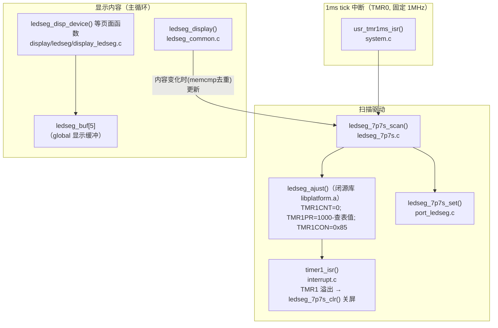
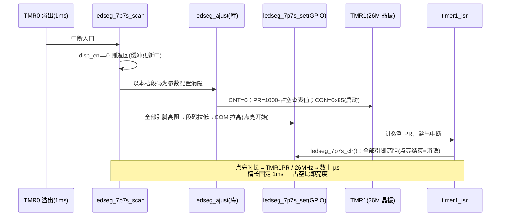

# 数码管（7P7S）基础原理与 SDK 代码实现

适用工程：AB5712F / bt8930 SDK，`app/projects/microphone`（`GUI_SELECT = GUI_LEDSEG_7P7S`，见 `config_wireless_mic.h:29`）。
本文分两部分：先讲数码管显示的通用原理，再对照本 SDK 逐层拆解代码实现。

---

## 1. 数码管基础原理

### 1.1 结构：段（SEG）与公共端（COM）

一个 7 段数码管由 8 个 LED 组成：7 个笔画段 `a b c d e f g` + 1 个小数点 `dp`。所有 LED 的一端并接到公共端（COM，即位选）：

```text
        a
      ┌───┐
    f │   │ b
      ├─g─┤
    e │   │ c
      └───┘ ● dp
        d

共阴接法：COM 接低电平，段脚给高电平点亮
共阳接法：COM 接高电平，段脚给低电平点亮
```

- **段选**（SEG）：决定这一位显示什么字形（数字/字母）；
- **位选**（COM）：决定哪一位数码管被点亮。

### 1.2 动态扫描：为什么不是每位的 COM 常开

多位数码管如果每一位都独立驱动，需要的引脚数 = 位数 × 8，太多。动态扫描利用**视觉暂留**（人眼 > 24Hz 的刷新率看起来就是稳定显示）：

1. 每个周期只点亮**一位**：拉通它的 COM，送上它的段码；
2. 点亮一小段时间（一个"槽"，slot）后熄灭，切到下一位；
3. 轮完一圈为一帧，帧率保持在 ~100Hz 以上人眼就看不到闪烁。

本工程 7 个 COM 槽 × 每槽 1ms = 7ms 一帧，帧率 ≈ **143Hz**。

关键概念：

| 概念 | 含义 | 对显示的影响 |
| --- | --- | --- |
| 槽（slot） | 一位数码管每次点亮的持续时间 | 本工程固定 1ms，由 1ms tick 中断保证 |
| 占空比（duty） | 槽内实际点亮时间的比例 | **直接决定亮度**；也限制 LED 平均电流 |
| 消隐（blanking） | 槽内主动关断显示的窗口 | 用于控制占空（亮度）；切换位选前消隐还能防止"拖影"（上一位的字形残留在下一位上） |

### 1.3 引脚复用矩阵（本工程的实际接法）

本工程没有独立的 COM/SEG 总线，而是 **7 个引脚的复用矩阵**：每个 1ms 槽里，把其中一个引脚拉高作公共端，其余引脚按段码拉低点亮对应 LED（引脚高阻即"熄灭"）。引脚分配见 `app/projects/microphone/port/port_ledseg.c`：

| 槽 | 引脚 |
| --- | --- |
| LEDSEG0~2 | PB0、PB1、PB2 |
| LEDSEG3~5 | PE5、PE6、PE7 |
| LEDSEG6 | PF1 |

全部开启高驱动（`GPIOxDRV`）保证足够的段电流。

### 1.4 亮度控制：TMR1 消隐定时器

点亮 = 槽开始时把 COM 拉高；熄灭 = 定时器到点把全部引脚置回高阻。槽长固定 1ms，**熄灭得越早点亮占空越小、越暗**。这就是亮度控制的机制：

```text
1ms 槽：  ├──────点亮──────┤（占空 100% → 最亮）
1ms 槽：  ├──30µs┤·········（占空 3%   → 很暗）
```

本工程用 TMR1 做这个"到点熄灭"的定时器（消隐定时器）。关键寄存器（`include/sfr.h`，SFR_BASE=0x100）：

| 寄存器 | 地址 | 作用 |
| --- | --- | --- |
| TMR1CON | 0x110 | bit0 TMREN 启动；bits[3:1] PCLKSEL 选时钟源；bit7 中断使能 |
| TMR1CNT | 0x118 | 计数器（写 0 清零） |
| TMR1PR | 0x11C | 周期重载值：点亮窗口 = TMR1PR / TMR1 时钟频率 |
| TMR1CPND | 0x114 | 溢出 pending（写 bit9 清除） |

时钟源由手册《ab571x_usermanual.pdf》Register 4-1 定义（bits[3:1] PCLKSEL）：`000=system clock`、`010=xosc26m_clk`、`110=tmr_inc_cr(1M 分频)` 等。本工程 lib 选择 **010 = 26M 晶振（固定频率）**，即 `CON = 0x85`（TMREN | PCLKSEL=010 | IRQ_EN）——消隐窗口的长短与系统主频无关。

> **原厂 lib 实现**（原厂提供的本芯片 `ledseg_ajust` 源码，与闭源库反汇编结果逐条吻合）：
>
> ```c
> AT(.com_text.ledseg)
> void ledseg_ajust(uint disp_seg)
> {
>     uint seg_num = s_bcnt(disp_seg);
>     if (seg_num > 0) {
>         //根据需要点亮的SEG数，设定不同的点亮时间。 seg_num越小，点亮时间越短
>         TMR1CNT  = 0;
>         TMR1PR   = 1000 - ledseg_tbl[seg_num-1];
>         TMR1CON  = BIT(7) | BIT(2) | BIT(0);   //timer1 interrupt en, timer1 counter mode
>     }
> }
> ```
>
> 即：段数越少 → 查表值越大 → PR 越小 → 点亮窗口越短，从而按段数均衡亮度。注意 `BIT(2)` 按本芯片手册 Register 4-1 属于 PCLKSEL（bits[3:1]=010=xosc26m_clk），消隐窗口与系统主频无关。

---

## 2. SDK 代码实现

### 2.1 驱动分层总览



### 2.2 数据流：从"要显示什么"到 GPIO


要点：

- **双层缓冲**：应用层写 `ledseg_buf`，扫描层用 `ledseg_cb.buf`；更新时 `disp_en` 先 0 后 1（`ledseg_7p7s_update_dispbuf_do`），避免扫描到半更新的缓冲；
- **去重**：`ledseg_display()` 用 `memcmp` 比较新旧内容，只有变化才走更新路径，但**扫描本身每 1ms 都在跑**（显示是持续刷新的）；
- **字形表**：`ledseg_common.c` 的 `ledseg_num_table[10]`（`T_LEDSEG_0..9` 宏）把数字 0~9 映射成段码位图。

### 2.3 每个 1ms 槽的完整时序



### 2.4 与系统主频的关系（重要）

| 定时器 | 时钟源 | 是否随主频变化 | 用途 |
| --- | --- | --- | --- |
| TMR0 | 固定 1MHz（PCLKSEL=110，26M 分频） | 否 | 1ms tick → COM 扫描节拍 |
| TMR1 | 26M 晶振（PCLKSEL=010） | 否 | 槽内消隐窗口 → 亮度 |

即**扫描节拍与亮度占空在硬件上都不依赖系统主频**。按原厂 lib 源码，`ledseg_ajust()` 在点亮段数 >0 时即启动消隐（按段数均衡亮度，占空约 2~3.5%，与主频无关）；本项目实测发现连接后消隐生效、待机档未武装（占空 100%），两档亮度落差导致"连接后变暗闪烁"的观感，修复为在 `ledseg_ajust()` 之后统一关闭消隐（`ledseg_7p7s.c`），完整过程见
[数码管无线连接后变暗闪烁排错](../client_problem/ledseg-dim-flicker-after-wireless-connect.md)。

### 2.5 显示内容层（应用侧怎么用）

页面函数集中在 `app/projects/microphone/display/ledseg/display_ledseg.c`，通过 `ledseg_disp_pfunc[]` 函数表按页面（DISP_DEVICE 等）分发：

- 数字/频率：`ledseg_disp_number()`（4 位，>9999 截断）；
- 图标：`ledseg_buf[4]` 的位定义（`display_ledseg.h`）：`ICON_BT`、`ICON_WIR_A`、`ICON_WIR_B` 等，例如无线麦页面显示 `24.02`/`24.08`（当前频道 MHz）+ 蓝牙图标，由双击切换（`msg_device.c`）；
- 电池：`disp_bat()` 按电量点亮 1~4 格图标，低电时结合 `gui_box_flicker`（100ms 节拍翻转的消隐标志）实现半格闪烁；
- 整屏闪烁：`gui_box_flicker_set()`（`modules/gui/gui.c`）设置消隐标志，特定页面（静音、时钟设置）在 `sta==1` 时不写缓冲，实现 1Hz 整屏闪烁。

### 2.6 关键文件索引

| 文件 | 职责 |
| --- | --- |
| `modules/gui/gui.h` / `gui.c` | `gui_scan()` 宏分发；`gui_init()` 初始化 timer1 中断；`gui_box_flicker` 机制 |
| `modules/gui/ledseg/ledseg_7p7s.c` | COM 轮询扫描、双缓冲、消隐修复点 |
| `modules/gui/ledseg/ledseg_common.c` | `ledseg_buf`、数字字形表、去重刷新、电池图标 |
| `projects/microphone/display/ledseg/display_ledseg.c` | 各页面内容（频率/时钟/电池/图标） |
| `projects/microphone/port/port_ledseg.c` | 引脚宏、高驱动配置、`ledseg_7p7s_set/clr` GPIO 操作 |
| `system/system.c` `usr_tmr1ms_isr()` | 1ms tick 入口，调 `gui_scan()` |
| `system/interrupt.c` `timer1_isr()` | TMR1 溢出 → 关屏（消隐执行点） |
| `include/sfr.h` | TMR0/TMR1 寄存器地址定义 |
| `docs/datasheet/ab571x_usermanual.pdf` | Register 4-1/4-2：定时器寄存器位定义（最终依据） |

### 2.7 移植/调整时的注意事项

1. 修改扫描节拍（1ms）需同步评估帧率（节拍 × 7）与 `ledseg_ajust` 的占空表基准；
2. 亮度调节优先走 lib 的占空机制（TMR1 窗口），不要在应用层直接动 TMR1PR——停表状态下该寄存器读值无效（读到 0xFFFFFFFF），盲做读-改-写会引发异常（实例见排错文档 §3.1）；
3. 换 IO 时同步更新 `port_ledseg.c` 的 `LEDSEG_ALL_DIRIN/HDRV_EN` 宏组与逐引脚 `LEDSEGn_H/L` 宏；
4. 段电流由高驱动 + 外部限流电阻决定，占空降低可显著降低平均电流与整机功耗（lib 在连接工作态默认消隐正是这个意图）。
